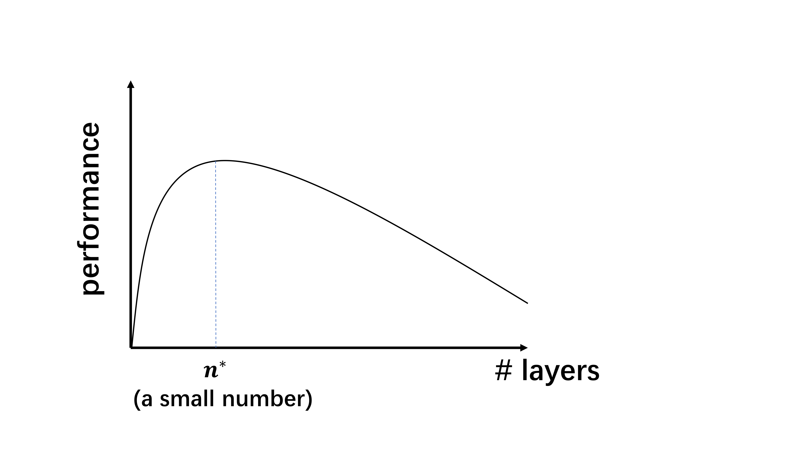
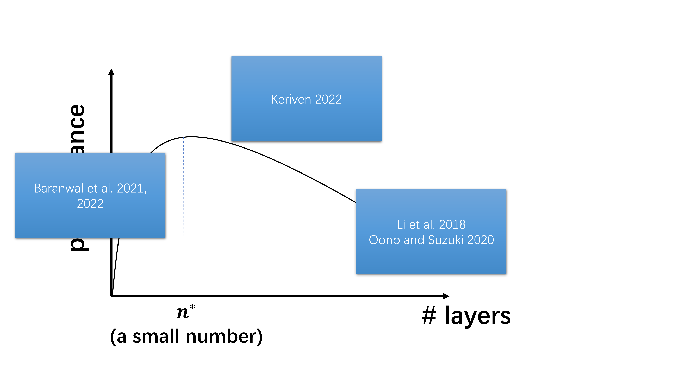
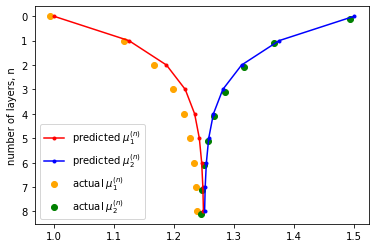
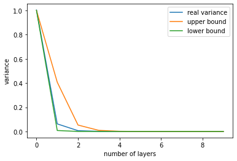

Oversmoothing is a well-known problem in message-passing GNNs. But why does it happen when a GNN only has 2-4 layers? In this post, I am going to discuss our ICLR'23 paper "[A Non-Asymptotic Analysis of Oversmoothing in Graph Neural Networks](https://arxiv.org/abs/2212.10701)", which develops the first finite depth theory of oversmoothing in graph neural networks (GNNs) and explains why oversmoothing would occur at a shallow depth.

Introduction
======

Most GNNs follow the message-passing paradigm, where  node representations are computed by recursively aggregating and transforming the representations of the neighboring nodes. One notably drawback of this repeated message-passing is **oversmoothing**, which refers to the phenomenon that increasing model depth leads to homogeneous node representations and thus worse downstream task performances. As a result, many GNNs used in practice remain shallow and often only have a few layers. 

Typical GNN performances with respect to the model depth would look like the following plot, where increasing network depth will first increase the performance, and once the model bypasses its optimal depth, which is typically a small number (e.g. 2-4 layers), the performance will quickly decrease.

Oversmoothing was something researchers noticed even back to the earliest days of the GNN field, when Kipf and Welling introduced the Graph Convolutional Network (GCN). So what has been understood about this performance plot in the past? 

- As the number of layers tends to infinity, oversmoothing is inevitable [Li et al. 2018, Oono and Suzuki 2020]. 
- Having "some" graph convolutions is better than having no graph convolutions [Baranwal et al. 2021, 2022].
- Combining the above two points of views, the optimal depth is finite (i.e. the curve should indeed have a hump shape) [Keriven 2022].

It seems that we have understood everything about this plot. So what hasn't been understood about oversmoothing? Let me emphasize the following point: the occurrence of oversmoothing itself in the asymptotic regime is not sufficient to make it an important empirical problem. For example, if one trains a CNN(ResNet) for image classification with increasing depth, the performance would have a similar shape as the curve in the above plot, except now the peak is at, say 100 layers. In that case, oversmoothing is no longer a problem. **It is the fast onset of oversmoothing makes it an important problem in practice for developing more powerful GNNs and there has not been a statisfactory theory about that.**

As such, the main goal of our work is to answer the following two questions: 

- Why does oversmoothing happen at a relatively shallow depth?
- Can we quantitatively model the effect of applying a finite number of graph convolutions and
theoretically predict the “sweet spot” for the choice of depth?

Two counteracting effects (one desirable and one undesirable) of message-passing
======
Message-passing homogenizes node represetnations. However, we should distinguish between two kinds of homogenization:
- **Denoising:** nodes within the same class become similar. This will make the classification task easier.
- **Mixing:** nodes among different classes become similar. This will make the classification task more difficult.

Analysis set-up
------
In our analysis, we formulize the above two effects by analyzing the effects of finite graph convolutions on a random graph model called the Contextual Stochastic Block Model (CSBM). In the CSBM, the graph structure is formed according to the standard SBM, i.e. nodes are divided into blocks. For a pair of nodes within the same block, there is an edge formed independently with probability $p$, and for a pair of nodes belonging to different blocks, the probability is $q$. The name "contextual" comes from the fact that in addition to the graph structure, the model also generates node features $X$. For nodes within the same block, their features are drawn indepedently from the same Gaussian distribution and different blocks draw the features from their own Gaussian distributions. We consider the case where we have two equal-sized blocks, each with $N/2$ nodes, and the initial Gaussian distributions for node features are $\mathcal{N}(\mu_i, \sigma^2), i =1,2$.

Our theoretical analysis focuses on the simplified linear GNN model defined as follows: a graph convolution using the (left-)normalized adjacency matrix takes the operation $$h' = (D^{-1}A)h,$$ where $h$ and $h'$ are the input and output node representations, respectively.  A linear GNN layer can then be defined as $$h' = (D^{-1}A) h W,$$ where $W$ is a learnable weight matrix.
As a result, the output of $n$ linear GNN layers can be written as $$h^{(n)}\prod_{k=1}^n W^{(k)},$$ where $h^{(n)}=(D^{-1}A)^n X$ is the output of $n$ graph convolutions, and $W^{(k)}$ is the weight matrix of the $k^{\text{th}}$ layer. Since this is linear in $h^{(n)}$, it follows that $n$-layer linear GNNs have the equivalent representation power as linear classifiers applied to $h^{(n)}$. Thus, we are interested in the distribution of $h^{(n)}$. Thanks to the linearity of the model, we see that the representation of node $v$ in block $i=1,2$ after $n$ graph convolutions is distributed as $\mathcal{N}(\mu_i^{(n)},(\sigma^{(n)})^2)$, where the variance $(\sigma^{(n)})^2$ is shared between classes. 

Intuition
------
Before presenting our results, let's first get some intuition about what  is happening when we apply graph convolutions. Since graph convolutions make nodes both across different classes and within the same class similar, schematically, that is to say, the means of the two Gaussian distributions will get closer (mixing), but the variance of each Gaussian will also shrink (denoising). The blue overlapping area represents two times the Bayes optimal error, that is, if one uses $h^{(n)}$ for classification, what is the lowest error he/she can get under the optimal classifier. 
 
The Bayes error in fact has a closed formula $1-\Phi(\frac{\mu_2^{(n)}-\mu_1^{(n)}}{\sigma^{(n)}})$, where $\Phi$ is the CDF function of the standard Gaussian. The higher the ratio $\frac{\mu_2^{(n)}-\mu_1^{(n)}}{\sigma^{(n)}}$, the lower the Bayes error and we expect better classification performance. We use $\mu_2^{(n)}-\mu_1^{(n)}$ (distance between the two means) to quantify the means collasping mixing effect, and $(\sigma^{(n)})^2$ (variance within the same class) to quantify the variance shrinking denoising effect.

Means always move together when you stack more graph convolutions
------
Our results (Theorem 1) shows that, approximately,

$$\mu_2^{(n)}-\mu_1^{(n)} \approx \left(\frac{p-q}{p+q}\right)^n(\mu_2-\mu_1),$$

which means that when one adds graph convolutions, means always move together exponentially fast. This coincides with the intuition people have deveoped in the asymptotic analysis.

In simulation, it is easy to verify the above approximation that means get closer exponentially fast:

Variance does not go down indefinitely when you stack more graph convolutions 
------
One misleading intuition some people have about GNNs, is that since stacking more graph convolutions gives information about larger neighborhoods of the graph, it should always give you a "better" result.  However, this is not true in practice. There is in fact, a nontrivial, absolute lower bound associated with the variace (Lemma 2).

$$\text{For all } n\geq 0,\frac{1}{N}\sigma^2 \leq (\sigma^{(n)})^2 \leq \sigma^2\,.$$

The intepretation of the above result is, since there is only a finite number of nodes in the graph, there is only finite amount of information in the graph. One certainly cannot go beyond the total amount of information, no matter how much message-passing one does. 

In our paper, we offer more refined bounds for each $(\sigma^{(n)})^2$, which suggests that the variance $(\sigma^{(n)})^2$ will initially go down at least at a rate exponential in $O(1/\log N)$ before it saturates at the fixed lower bound $\sigma^2/N$. This means that after $O(\log N/\log(\log N))$ layers, the desirable denoising effect homogenizing node representations in the same class will saturate and the undesirable mixing effect will start to dominate. 

In simulation, it is clear to see this saturation effect in variance, both in synthetic graphs generated from the CSBM, and real graphs.

Why does oversmoothing happen at a shallow depth?
------
Putting everything together, we can see why does oversmoothing happen at a shallow depth in GNNs:

Do popular proposed solutions to oversmoothing really work?
======

TL;DR: Not really. The problem of many solutions is that they are based on the understanding of oversmoothing in the asymptotic regime, which becomes incomplete in the non-asymptotic case as we have seen. Therefore, with the new insights we develop, these methods can actually be proven to be worse than vanilla GNNs on certain graphs. Specifically, in our paper, we extend the analysis to APPNP/GCNII, which are equivalent but has different motivations: APPNP uses the (approximate) Personalized PageRank propagation to replace the original graph convolution, and GCNII adds a residual connection to the initial node representations from each subsequent layer.
The 

   Similar reasoning and analysis can be also applied to other methods like PairNorm.

[def]: images/performance_0.pdf